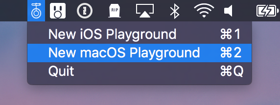
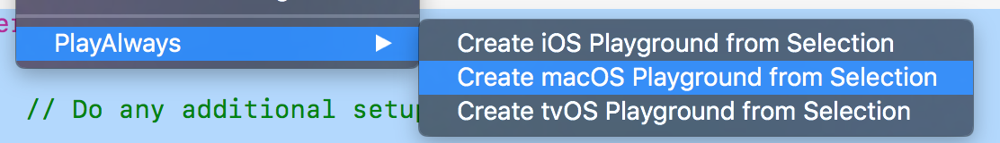

## PlayAlways - Create playgrounds quickly

PlayAlways is a menubar app to quickly create new iOS or macOS playgrounds.

[⬇️ LATEST RELEASE ⬇️](https://github.com/insidegui/PlayAlways/releases/latest)

When you first create a playground, the app will ask where to save it. After you've set the path, that's where the playgrounds will be saved until you set a new one by choosing "Set Path".

If you want to choose where to save the playground, you can hold down option when choosing the playground type and a save panel will appear allowing you to choose the location for that specific playground.

### Xcode extension

PlayAlways also includes an Xcode extension so you can quickly create playgrounds from the selected code. Playgrounds created from the extension are saved to the default path. Please note that the app must be running for the extension to work.

### Acknowledgments

Thanks [@dbonates](https://github.com/dbonates) for the the original idea 😃